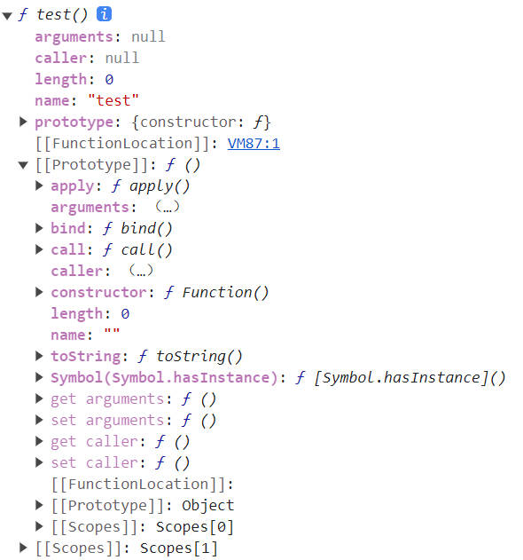

## 面向对象

 [深入理解javascript原型和闭包（完结） - 王福朋 - 博客园 (cnblogs.com)](https://www.cnblogs.com/wangfupeng1988/p/3977924.html)

### 一、一切都是对象

**“一切都是对象”这句话的重点在于如何去理解“对象”这个概念。**

——当然，也不是所有的都是对象，值类型就不是对象。

`typeof` 函数输出的一共有几种类型，在此列出：

```js
function show(x) {        
	console.log(typeof x);    // undefined
	console.log(typeof 10);   // number
	console.log(typeof 'abc'); // string
	console.log(typeof true);  // boolean
	console.log(typeof function () {});  //function
	console.log(typeof [1, 'a', true]);  //object
	console.log(typeof { a: 10, b: 20 });  //object
	console.log(typeof null);  //object
	console.log(typeof new Number(10));  //object
    }
show();
```

以上代码列出了 `typeof` 输出的集中类型标识，其中上面的四种（undefined, number, string, boolean）属于简单的值类型，不是对象。剩下的几种情况——函数、数组、对象、null、new Number(10)都是对象。他们都是引用类型。

判断一个变量是不是对象非常简单。值类型的类型判断用 `typeof` ，引用类型的类型判断用 `instanceof` 。

```js
var fn = function () { };
console.log(fn instanceof Function);  // true
console.log(fn instanceof Object);  // true
```

至于 `instanceof` 的原理，后面会讲解。

#### 1. JS 中对象的定义

**对象——若干属性的集合。**

`java` 或者 `C#` 中的对象都是new一个class出来的，而且里面有字段、属性、方法，规定的非常严格。但是`javascript` 就比较随意了——数组是对象，函数是对象，对象还是对象。对象里面的一切都是属性，只有属性，没有方法。那么这样方法如何表示呢？——方法也是一种属性。因为它的属性表示为键值对的形式。

而且，`javascript` 中的对象可以任意的扩展属性，没有class的约束。

只要是对象，它就是属性的集合。以函数为例子：

```js
var fn = function () {
	    alert(100);
	};
fn.a = 10;
fn.b = function () {
    alert(123);
};
fn.c = {
    name: "王福朋",
    year: 1988
};
console.log(fn.b)
/**
ƒ () {
    alert(123);
}
**/
```

上段代码中，函数就作为对象被赋值了a、b、c三个属性——很明显，这就是属性的集合。

在jQuery源码中，“jQuery”或者“$”，这个变量其实是一个函数，可以用 `typeof` 验证一下。

```js
console.log(typeof $);  // function
console.log($.trim(" ABC "));	// ”ABC“
```

一切（引用类型）都是对象，对象是**属性的集合**。最需要了解的就是对象的概念，和 `java/C#` 完全不一样。所以，切记切记！


在 `typeof` 的输出类型中，function和object都是对象。而且对一个function使用 `instanceof` 时，对 Function 和 Object 都输出 True，这是为什么呢？这就需要理解：


### 二、函数和对象的关系

函数就是对象的一种，因为通过 `instanceof` 函数可以判断。

```js
var fn = function () { };
console.log(fn instanceof Object);  // true
```

函数是一种对象，但是函数却不像数组一样——你可以说数组是对象的一种，因为数组就像是对象的一个子集一样。但是函数与对象之间，却不仅仅是一种包含和被包含的关系，函数和对象之间的关系比较复杂，甚至有一点鸡生蛋蛋生鸡的逻辑，咱们这一节就缕一缕。

先看一个小例子吧。

```js
function Fn() {
    this.name = '王福朋';
    this.year = 1988;
}
var fn1 = new Fn();
```

上面的这个例子很简单，它能说明：对象可以通过函数来创建。对！也只能说明这一点。

但是我要说——**对象都是通过函数创建的**——有些人可能反驳：不对！因为：

```js
var obj = { a: 10, b: 20 };
var arr = [5, 'x', true];
```

但是不好意思，这个——真的——是一种——“快捷方式”，在编程语言中，一般叫做“语法糖”。

做“语法糖”做的最好的可谓是微软大哥，它把他们家C#那小子弄的不男不女从的，本想图个人见人爱，谁承想还得到处跟人解释——其实它是个男孩！

话归正传——其实以上代码的本质是：

```js
//var obj = { a: 10, b: 20 };
//var arr = [5, 'x', true];

var obj = new Object();
obj.a = 10;
obj.b = 20;

var arr = new Array();
arr[0] = 5;
arr[1] = 'x';
arr[2] = true;
```

而其中的 Object 和 Array 都是函数：

```js
console.log(typeof (Object));  // function
console.log(typeof (Array));  // function
```

所以，可以很负责任的说——对象都是通过函数来创建的。

对象是函数创建的，而函数却又是一种对象，至于为什么，需要理解 `prototype` 原型。


### 三、原型

#### 1. prototype

每个函数都有一个属性叫做 `prototype` 。这个 `prototype` 的属性值是一个对象，默认的只有一个叫做constructor的属性，指向这个函数本身。


原型既然作为对象，属性的集合，不可能就只弄个constructor来玩玩，肯定可以自定义的增加许多属性。例如这位Object大哥，人家的prototype里面，就有好几个其他属性。


你也可以在自己自定义的方法的 `prototype` 中新增自己的属性：

```js
function Fn() { }
Fn.prototype.name = 'Corey';
Fn.prototype.getYear = function () {
    return 2001;
};
```

原型中的属性可以直接调用：

```js
function Fn() { }
Fn.prototype.name = 'Corey';
Fn.prototype.getYear = function () {
    return 2001;
};

var fn = new Fn();
console.log(fn.name);	// "Corey"
console.log(fn.getYear());	// 2001
```

原型有点类似“继承”的感觉。之所以能做到这样，是因为每个对象都有一个隐藏的属性—— `__proto__` ，这个属性引用了创建这个对象的函数的 `prototype` 。即：`fn.__proto__ === Fn.prototype` 。

#### 2. \_\_proto\_\_

上节已经提到，**每个函数function都有一个 `prototype`** ，即原型。这里再加一句话——**每个对象都有一个`__proto__`**，即隐式原型。

这个`__proto__`是一个隐藏的属性，javascript不希望开发者用到这个属性值，有的低版本浏览器甚至不支持这个属性值。所以你在Visual Studio 2012这样很高级很智能的编辑器中，都不会有`__proto__`的智能提示，但是你不用管它，直接写出来就是了。

```js
const obj = {}
// const obj = new Object()
console.log(obj.__proto__)
```


上面截图看来，`obj.__proto`__ 和 `Object.prototype` 的属性一样！obj这个对象本质上是被Object函数创建的，因此 `obj.__proto__=== Object.prototype` 。

自定义函数的 `prototype` 本质上就是和 var obj = {} 是一样的，都是被Object创建，所以它的 `__proto__` 指向的就是 `Object.prototype` 。

---

`Object prototype` 也是一个对象，它的 `__proto__` 指向哪里？ `Object.prototype` 确实一个特例——它的 `__proto__` 指向的是 `null` ，可以理解为 Object 是所有对象的父类。

#### 3. 函数和对象的关系

对象是函数创建的，而函数却又是一种对象。

解释第一句话，我们创建对象时，其实是调用了构造函数，此时对象的隐式原型 `__proto__` 会指向构造函数的 `prototype` 。

解释第二句话，每个函数都有自己的原型属性 `prototype` ，所以函数也是对象。所以每个函数也有自己的隐式原型 `__proto__` 。

那么函数既然是对象，它也是被构造函数创建出来的，他也有自己的 `__proto__` 。所有函数的构造函数都是 `Function` ，一般创建函数的语法其实是语法糖：

```js
// 语法糖
function fn1(x, y) {
    return x - y
}
// 使用构造函数创建
const fn2 = new Function("x", "y", "return x - y")
```

函数的构造函数 `Function` 的 `__proto__` 指向谁呢？也就是哪个构造函数构造了 `Function` ，答案是它本身，即：`Function.__proto__ === Function.prototype`


### 四、继承 & 原型链

javascript中的继承是通过原型链来体现的。先看几句代码：

```js
function Test() { }
const f1 = new Test()
f1.a = 10
Test.prototype.a = 100
Test.prototype.b = 200
console.log(f1.a)	// 10
console.log(f1.b)	// 200
```

以上代码中，`f1` 是`Test` 函数 new 出来的对象，`f1.a` 是 `f1` 对象的基本属性， `f1.b` 是怎么来的呢？——从`Test.prototype` 得来，因为 `f1.__proto` __指向的是 `Test.prototype` 。

**访问一个对象的属性时，先在基本属性中查找，如果没有，再沿着 `__proto__` 这条链向上找，这就是原型链。**


由于所有的对象的原型链都会找到 `Object.prototype` ，因此所有的对象都会有 `Object.prototype` 的方法。这就是所谓的“继承”。

再举一个函数的例子：

我们都知道每个函数都有call，apply方法，都有length，arguments，caller等属性。为什么每个函数都有？这肯定是“继承”的。函数由Function函数创建，因此继承的 `Function.prototype` 中的方法。

那怎么还有 `hasOwnProperty` 呢？——那是 `Function.prototype` 继承自 `Object.prototype` 的方法。

#### 1. 区分 `__proto__` 和 `prototype`

`prototype` 可以理解为类的属性，可用于继承；`__proto__` 则表示继承于谁。

每个对象在查找时，先查找自己的属性，再查找自己的 `prototype` ，最后再查找 `__proto__` ，所以 `__proto__` 告诉对象它继承于谁。而`__proto__` 指向 `prototype` ，所以 `prototype` 包含了用于继承的属性。

还是以函数为例子，创建一个函数：

```js
function test() {}
console.dir(test)
```



可以看到， `test` 的 `prototype` 内只有一个指向自己的构造函数；`__proto__` (`[[Prototype]]`)指向了 `Function.prototype` ，所以 `test` 可以调用函数的内置 api ；并且`Function.prototype` 包含了指向 `Object` 的 `prototype` ，所以函数也可以调用 `Object` 的 api 。

这正诠释了“一切都是对象”，即一切都可以调用对象的 api 。

#### 2. 对象属性查找顺序

原型链主要用于查找对象的属性（方法）；访问一个对象的属性时，

- 先在自身属性中查找，找到则返回
- 如果没有，在沿着\_\_proto\_\_这条链向上查找，找到返回
- 如果最终没找到，则返回 undefined

### 五、`instanceof`

对于值类型，可以通过 `typeof` 判断，string/number/boolean都很清楚，但是 `typeof` 在判断到引用类型的时候，返回值只有object/function，你不知道它到底是一个object对象，还是数组，还是new Number等等。

```js
function Test() {}
const f1 = new Test()

console.log(f1 instanceof Test)	// True
console.log(f1 instanceof Object)	// True
```

`instanceof` 运算符的第一个变量是一个对象，暂时称为A；第二个变量一般是一个函数，暂时称为B。

`instanceof` 的判断逻辑是：沿着A的 `__proto__` 这条线来找，同时沿着B的 `prototype` 这条线来找，如果两条线能找到同一个引用，即同一个对象，那么就返回true。如果找到终点还未重合，则返回false。

以上代码中，`f1` 的 `__proto__` 指向 `Test.prototype` ，并且 `Test.prototype` 包含其本身(构造函数)，所以 `f1 instanceof Test === True` ；`Test` 的 `prototype` 包含了指向 `Object.prototype`，所以`f1 instanceof Object === True` 。


`instanceof` 这样设计，到底有什么用？ `instanceof` 表示的就是一种继承关系，或者原型链的结构。


### 六、创建对象

#### 1. 构造函数

除了直接用`{ ... }`创建一个对象外，JavaScript还可以用一种构造函数的方法来创建对象。它的用法是，先定义一个构造函数：

```js
function Student(name) {
    this.name = name;
    this.hello = function () {
        alert('Hello, ' + this.name + '!');
    }
}
```

你会问，咦，这不是一个普通函数吗？

这确实是一个普通函数，但是在JavaScript中，可以用关键字`new`来调用这个函数，并返回一个对象：

```js
var xiaoming = new Student('小明');
xiaoming.name; // '小明'
xiaoming.hello(); // Hello, 小明!
```

*注意*，如果不写`new`，这就是一个普通函数，它返回`undefined`。但是，如果写了`new`，它就变成了一个构造函数，它绑定的`this`指向新创建的对象，并默认返回`this`，也就是说，不需要在最后写`return this;`。

新创建的`xiaoming`的原型链是：

```js
xiaoming ----> Student.prototype ----> Object.prototype ----> null
```

当创建多个学生对象时，这些对象都有自己的hello函数，然而这个函数是重复的，会浪费内存，所以不如通过原型链继承：

```js
function Student(name) {
    this.name = name;
}

Student.prototype.hello = function () {
    alert('Hello, ' + this.name + '!');
};
```

我们还可以编写一个`createStudent()`函数，在内部封装所有的`new`操作。一个常用的编程模式像这样：

```js
function Student(props) {
    this.name = props.name || '匿名'; // 默认值为'匿名'
    this.grade = props.grade || 1; // 默认值为1
}

Student.prototype.hello = function () {
    alert('Hello, ' + this.name + '!');
};

function createStudent(props) {
    return new Student(props || {})
    // https://www.runoob.com/w3cnote/javascript-or-and-and.html
}
```

这个`createStudent()`函数有几个巨大的优点：一是不需要`new`来调用，二是参数非常灵活，可以不传，也可以这么传：

```js
var xiaoming = createStudent({
    name: '小明'
});

xiaoming.grade; // 1
```

如果创建的对象有很多属性，我们只需要传递需要的某些属性，剩下的属性可以用默认值。由于参数是一个`Object` ，我们无需记忆参数的顺序。

#### 2. 工厂函数

工厂函数其实就是用来生产 **相同属性** 的对象的函数，通过它我们可以构造出许多 **属性相同**，但拥有 **不同属性值** 的对象，下面给出一个代码示例，直观感受下

```javascript
    function factory(name,age){
        const obj = {}
        obj.name = name
        obj.age = age
        return obj
    }
    var obj = factory('carl','28')
```

从代码示例中我们可以知道它的生产过程如下

1. 接受自定义属性值
2. 新建一个对象
3. 给新建的对象赋值自定义属性
4. 返回新创建的对象

由于每次生产过程中，都会重新创建对象，因此每一次生产出来的对象都是全新的。


### 七、对象继承

JavaScript的对象模型是基于原型实现的，特点是简单，缺点是理解起来比传统的类－实例模型要困难，最大的缺点是继承的实现需要编写大量代码，并且需要正确实现原型链。我直接不学原型链继承！

新的关键字`class`从ES6开始正式被引入到JavaScript中。`class`的目的就是让定义类更简单。

我们先回顾用函数实现`Student`的方法：

```js
function Student(name) {
    this.name = name;
}

Student.prototype.hello = function () {
    alert('Hello, ' + this.name + '!');
}
```

如果用新的`class`关键字来编写`Student`，可以这样写：

```js
class Student {
    constructor(name) {
        this.name = name;
    }

    hello() {
        alert('Hello, ' + this.name + '!');
    }
}
```

比较一下就可以发现，`class`的定义包含了构造函数`constructor`和定义在原型对象上的函数`hello()`（注意没有`function`关键字），这样就避免了`Student.prototype.hello = function () {...}`这样分散的代码。

最后，创建一个`Student`对象代码和前面章节完全一样：

```js
var xiaoming = new Student('小明');
xiaoming.hello();
```

#### 1. class 继承

用`class`定义对象的另一个巨大的好处是继承更方便了。想一想我们从`Student`派生一个`PrimaryStudent`需要编写的代码量。现在，原型继承的中间对象，原型对象的构造函数等等都不需要考虑了，直接通过`extends`来实现：

```js
class Student {
    constructor(name) {
        this.name = name;
    }

    hello() {
        alert('Hello, ' + this.name + '!');
    }
}

class PrimaryStudent extends Student {
    constructor(name, grade) {
        super(name); // 记得用super调用父类的构造方法!
        this.grade = grade;
    }

    myGrade() {
        alert('I am at grade ' + this.grade);
    }
}
```

注意`PrimaryStudent`的定义也是class关键字实现的，而`extends`则表示原型链对象来自`Student`。子类的构造函数可能会与父类不太相同，例如，`PrimaryStudent`需要`name`和`grade`两个参数，并且需要通过`super(name)`来调用父类的构造函数，否则父类的`name`属性无法正常初始化。

`PrimaryStudent`已经自动获得了父类`Student`的`hello`方法，我们又在子类中定义了新的`myGrade`方法。

ES6引入的`class`和原有的JavaScript原型继承有什么区别呢？实际上它们没有任何区别，`class`的作用就是让JavaScript引擎去实现原来需要我们自己编写的原型链代码。简而言之，用`class`的好处就是极大地简化了原型链代码。


### 八、 class

类是用于创建对象的模板。他们用代码封装数据以处理该数据。JS 中的类建立在原型上。

#### 1. 定义类

定义类的一种方法是使用**类声明**。要声明一个类，你可以使用带有`class`关键字的类名。

```js
class Rectangle {
  constructor(height, width) {
    this.height = height;
    this.width = width;
  }
}
```

**函数声明**和**类声明**之间的一个重要区别在于，函数声明会[提升](https://developer.mozilla.org/zh-CN/docs/Glossary/Hoisting)，类声明不会。你首先需要声明你的类，然后再访问它，否则类似以下的代码将抛出[`ReferenceError`](https://developer.mozilla.org/zh-CN/docs/Web/JavaScript/Reference/Global_Objects/ReferenceError)：

```js
let p = new Rectangle(); // ReferenceError

class Rectangle {}
```

##### 类表达式

**类表达式**是定义类的另一种方法。类表达式可以命名或不命名。命名类表达式的名称是该类体的局部名称。(不过，可以通过类的 (而不是一个实例的) [`name`](https://developer.mozilla.org/zh-CN/docs/Web/JavaScript/Reference/Global_Objects/Function/name) 属性来检索它)。

```js
// 未命名/匿名类
let Rectangle = class {
  constructor(height, width) {
    this.height = height;
    this.width = width;
  }
};
console.log(Rectangle.name);
// output: "Rectangle"

// 命名类
let Rectangle = class Rectangle2 {
  constructor(height, width) {
    this.height = height;
    this.width = width;
  }
};
console.log(Rectangle.name);
// 输出："Rectangle2"
```


class 还有一些功能仍在实验，等确定以后再学习稳定的语法。
